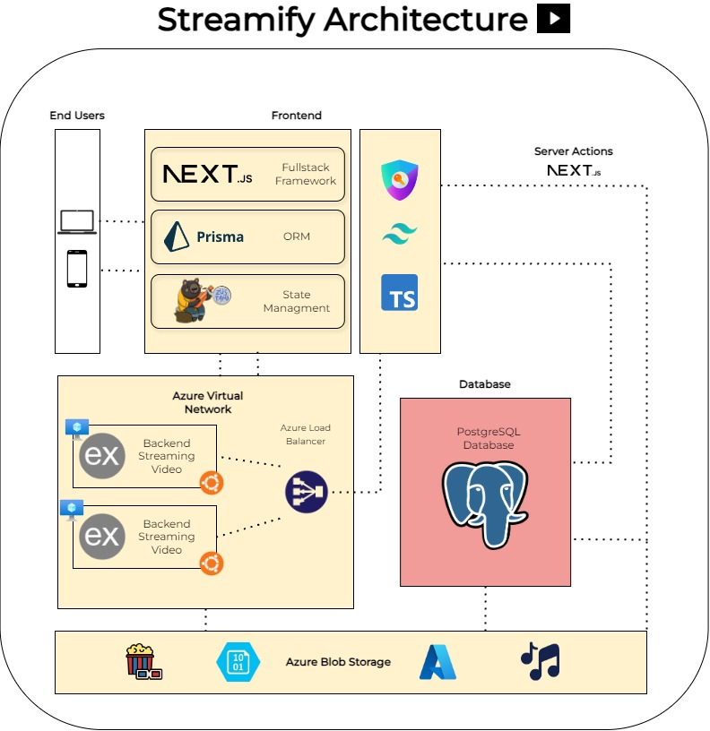

<div align="center">
<a href="#">

</a>
<p></p>
</div>

## 🛠️ Stack

- [**NextJS**](https://nextjs.org/) - React framework for building full-stack web applications.
- [**Typescript**](https://www.typescriptlang.org/) - JavaScript with syntax for types.
- [**Tailwindcss**](https://tailwindcss.com/) - CSS framework for building custom designs.
- [**Express**](https://expressjs.com/) - Framework that provides a robust set of features for web and mobile applications..
- [**Prisma**](https://www.prisma.io/orm) - Next-generation Node.js and TypeScript ORM.
- [**PostgreSQL**](https://www.postgresql.org/) - Open source object-relational database system.
- [**Azure Blob Storage**](https://azure.microsoft.com/en-us/products/storage/blobs) - Massively scalable and secure object storage for cloud-native workloads, archives, data lakes, high-performance computing, and machine learning.
- [**Azure Load Balancer**](https://azure.microsoft.com/es-es/products/load-balancer/) - Load balances Internet and private network traffic with high performance and low latency.

## 📐Diagram of the Architecture 

<div align="center">
<a href="#">

</a>
<p></p>
</div>

The architecture integrates several key components, each with a specific role in delivering the video streaming service. Below is a step-by-step explanation of how everything connects:

1. **Frontend**:  
   The **Next.js** application is the entry point for end users, providing both the frontend interface and handling server-side actions. Users interact with the system via their web browser or mobile device, sending requests to view videos or manage their libraries.

2. **API Calls and State Management**:  
   Within the frontend, state is managed using a state management library (likely **Zustand** or a similar solution). This helps track user interactions and video content across different sessions. API calls are made from the frontend to backend services using **TypeScript** for type safety.

3. **Prisma ORM**:  
   Next.js communicates with the **PostgreSQL** database through **Prisma**, an ORM tool. Prisma generates type-safe queries that allow the application to easily read and write data related to users, libraries, and video metadata. These queries are sent over secure channels to ensure data consistency and security.

4. **Backend Services (Express.js)**:  
   The backend, built using **Express.js**, handles video streaming requests. When users request a video, the backend fetches the video data from **Azure Blob Storage**, which houses all multimedia content. The Express.js service fetches the requested video file and streams it to the frontend, providing fast and reliable content delivery.

5. **Azure Virtual Network and Load Balancer**:  
   The system utilizes **Azure Virtual Network** to host multiple backend instances. The **Azure Load Balancer** distributes incoming requests to these instances, ensuring that no single server is overwhelmed by traffic. This enhances system reliability and scalability, especially during high-demand periods.

6. **Azure Blob Storage**:  
   Multimedia files (videos, audio, etc.) are stored in **Azure Blob Storage**. This cloud storage service offers secure, redundant, and scalable storage. The backend fetches these files from Blob Storage as requested by users and streams the content via Express.js. The system ensures that media files are always accessible, even during high traffic.

7. **PostgreSQL Database**:  
   The **PostgreSQL** database stores important information like user data, library records, and metadata about the videos. The connection between Prisma and PostgreSQL ensures smooth interactions, and all data is persistently stored.


## ⚙️ Process Optimization

In this distributed video streaming system, process optimization is crucial to ensure efficient resource utilization, minimize latency, and handle large volumes of simultaneous requests. Below are the key optimizations implemented across the system:

### 1. **Load Balancing for Scalability and High Availability**
   The backend services are optimized using an **Azure Load Balancer** that evenly distributes incoming traffic across multiple instances of **Express.js** servers. This prevents any single server from becoming a bottleneck, ensuring that user requests are handled efficiently and improving system scalability during peak traffic times.

### 2. **Efficient Video Streaming with Chunking**
   The backend **Express.js** services use optimized video streaming techniques such as **chunked transfer encoding**. Instead of loading the entire video file at once, the video is divided into smaller chunks, which are streamed to the frontend on demand. This minimizes memory consumption on both the server and client side, and allows users to start watching videos with minimal delay, even on slower networks.

### 3. **Prisma Optimizations for Database Access**
   **Prisma ORM** provides optimized database queries by only selecting the necessary fields from the **PostgreSQL** database. Additionally, Prisma can leverage database indices to make querying more efficient, reducing query execution times. Batch queries are also used to minimize the number of database calls, particularly when fetching user data or video metadata.

### 4. **Asynchronous Processing**
   Wherever possible, asynchronous operations are utilized across both the frontend and backend. This ensures non-blocking I/O, which is especially important for network-bound operations such as streaming from Azure Blob Storage and handling API requests. By using **async/await** in **TypeScript**, the system processes multiple requests concurrently without causing delays.

### 5. **Server-Side Rendering (SSR) with Next.js**
   **Next.js** leverages **Server-Side Rendering (SSR)** to pre-render pages on the server before they are sent to the client. This reduces the amount of processing required on the client side and improves page load times, particularly for users with slower devices or connections. It also enhances the system’s SEO performance by generating fully rendered HTML pages on the server.


## 🚀 Getting Started (Frontend)

> [!IMPORTANT]
> You will need an Azure Account to run this project. You can create a free account [here](https://azure.microsoft.com/en-us/free/).

You will need:

- [Node.js 18+](https://nodejs.org/en/).
- [Git](https://git-scm.com/).
- [PostgreSQL](https://www.postgresql.org/).
- [Azure Account](https://azure.microsoft.com/en-us/free/).

```bash
git clone git@github.com:your_username/op-project.git
```

2. Install dependencies:

```bash
cd op-project

npm install
```

3. Create a `.env` file in the root of the project with the following content:

```bash

POSTGRES_URL=""
POSTGRES_PRISMA_URL=""
POSTGRES_URL_NO_SSL=""
POSTGRES_URL_NON_POOLING=""
POSTGRES_USER=""
POSTGRES_HOST=""
POSTGRES_PASSWORD=""
POSTGRES_DATABASE=""
AUTH_SECRET="" 
AUTH_GITHUB_ID=""
AUTH_GITHUB_SECRET=""
```

4. Run the project:

```bash
npm run dev
```

5. Open [http://localhost:3000](http://localhost:3000) with your browser to see the result.


## 🚀 Setup Backend

<!-- https://github.com/alerodriguezn/back_streamify git clone from this and configure the ENV  -->

1. Clone the backend repository:

```bash
git clone https://github.com/alerodriguezn/back_streamify
```

2. Install dependencies:

```bash
cd back_streamify

npm install
```

3. Create a `.env` file in the root of the project with the following content:

```bash
AZURE_STORAGE=""
POSTGRES_URL=""
POSTGRES_PRISMA_URL=""
POSTGRES_URL_NO_SSL=""
POSTGRES_URL_NON_POOLING=""
POSTGRES_USER=""
POSTGRES_HOST=""
POSTGRES_PASSWORD=""
POSTGRES_DATABASE=""
```

4. Run the project:

```bash
npm run dev
```

5. Open [http://localhost:5000](http://localhost:5000) with your browser to see the result.

## 🚀 Setup Azure Blob Storage

1. Create an Azure Blob Storage account in the Azure Portal.

2. Create a container in the Blob Storage account to store the video files.

3. Upload video files to the container.

4. Copy the connection string for the Blob Storage account and add it to the backend `.env` file.

## 🚀 Setup Azure Load Balancer

1. Create an Azure Virtual Network in the Azure Portal.

2. Create multiple instances of the backend service (Express.js) and deploy them to the virtual network.

3. Create an Azure Load Balancer and configure it to distribute traffic across the backend instances.

4. Test the load balancer by sending requests to the backend service and verifying that traffic is evenly distributed.


> [!IMPORTANT]
> Remember that you need a database to run the project. You can use a local database or a cloud service like Azure Database for PostgreSQL.

## ✌️ Contributing

<a href="https://github.com/alerodriguezn/streamify/graphs/contributors">
  
</a>


